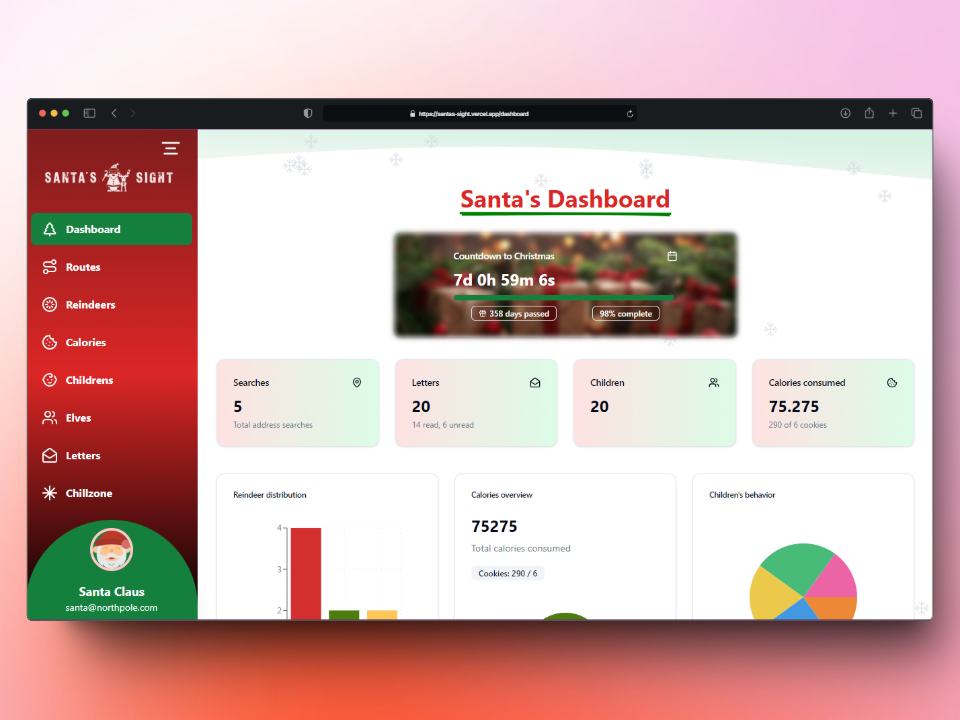
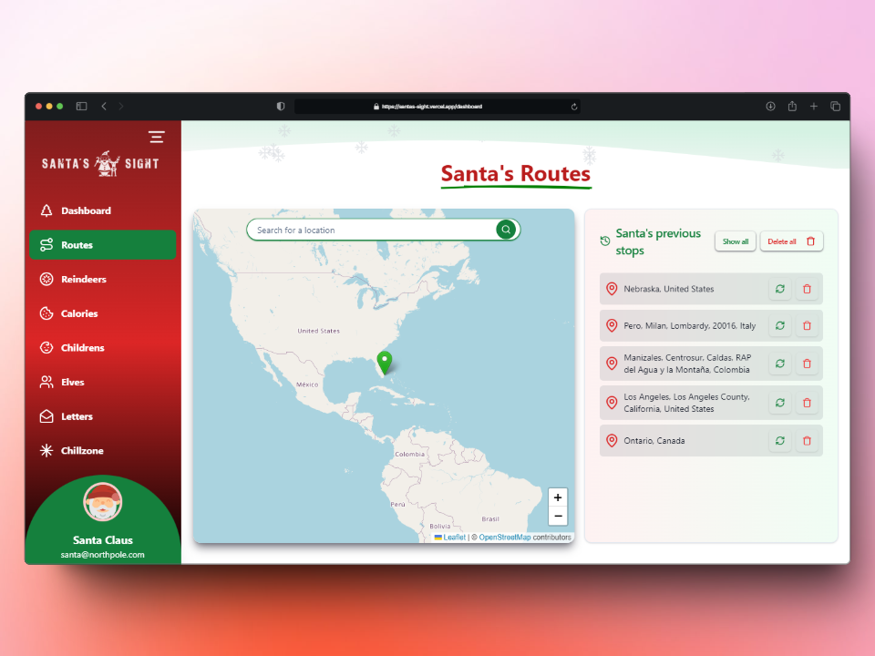
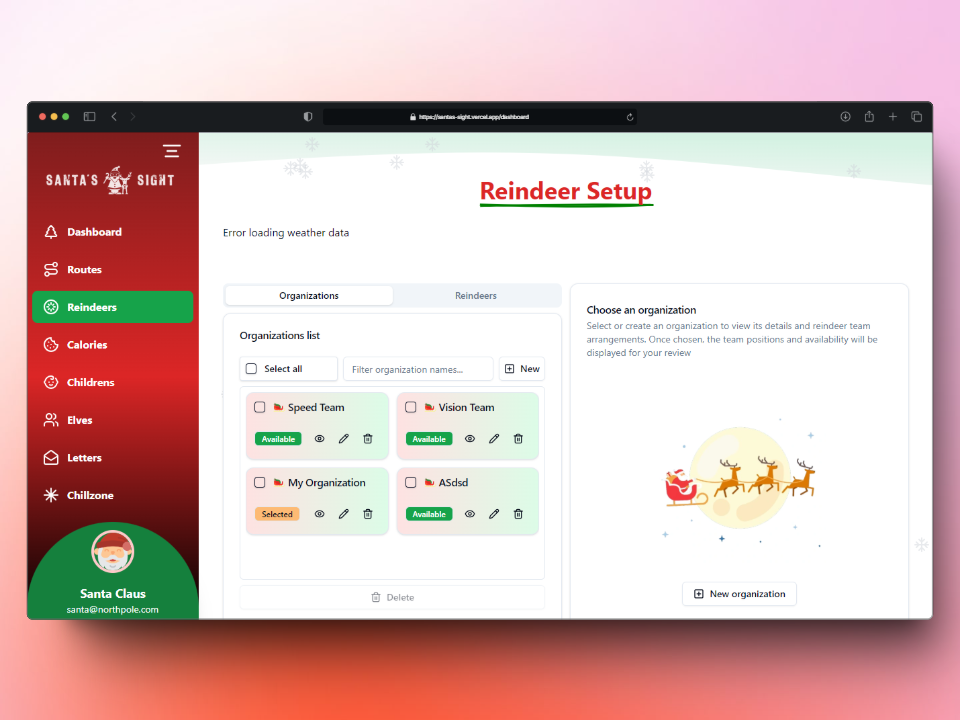
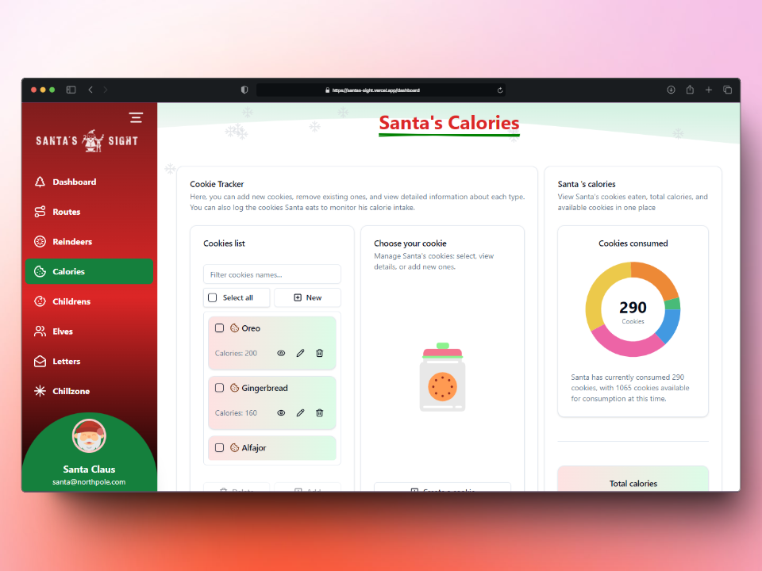
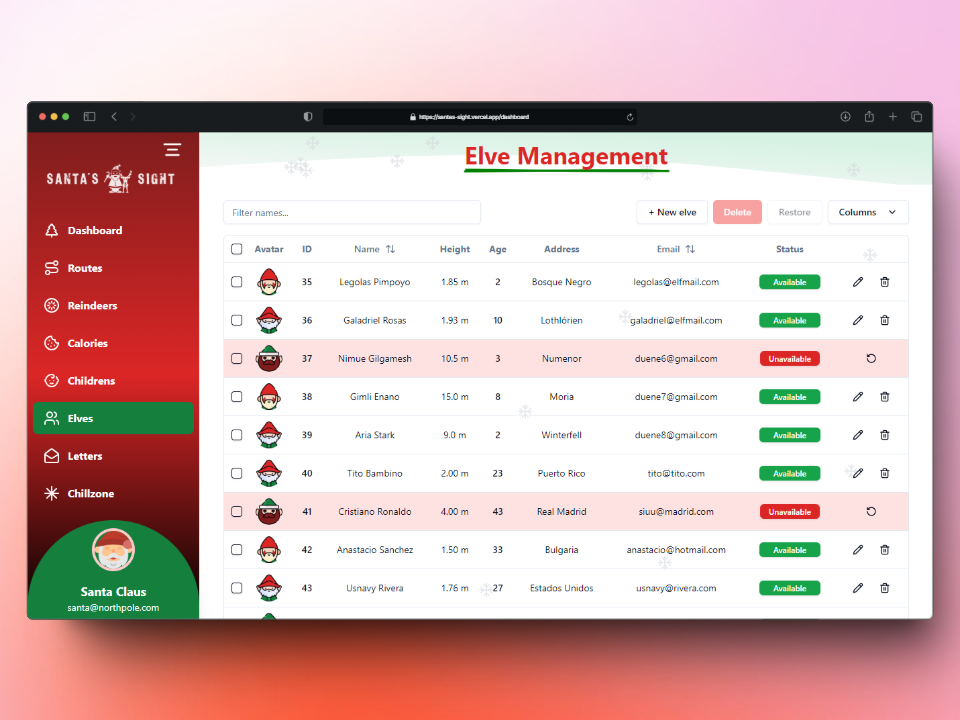

  

  # Santa's Sight

  🎄 A comprehensive Christmas operations management dashboard

## 📖 Overview

Santa's Sight is a modern web application designed to help manage Christmas operations efficiently. It provides a suite of tools for tracking elves, reindeer, routes, and more, all within a festive and user-friendly interface.

## 🌟 Features

- **Dashboard** - Overview of all Christmas operations
- **Elves Management** - Track and manage elf activities
- **Reindeer Tracking** - Monitor reindeer health and readiness
- **Route Planning** - Optimize Santa's delivery routes
- **Letters Management** - Process children's Christmas letters
- **Chill Zone** - Relaxation area monitoring
- **Children Database** - Manage nice/naughty list
- **Calories Tracker** - Monitor Santa's cookie consumption

## 📚 Documentation

For detailed technical documentation and component specifications, please visit our [Technical Documentation](https://topaz-price-4e1.notion.site/Propuesta-Dise-o-TEAM3-ED8-12d4111b2f52808aae9aeedc2c02cd64?pvs=4).

  Made with ❤️ by Team 3 ED8

